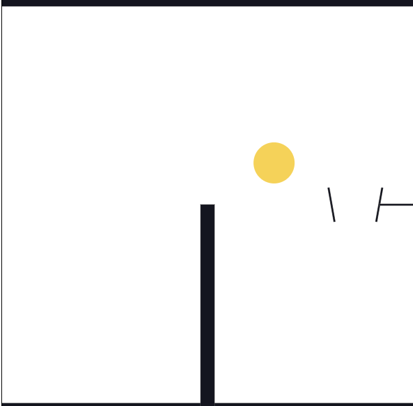
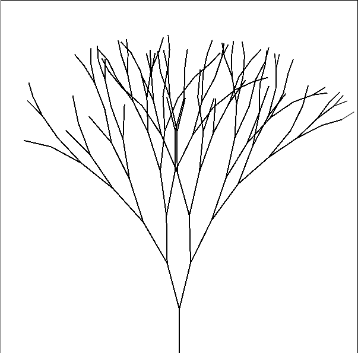

# daily relaxation 

this repository will store some easy exercises, you can spend a little time to complete it. All practice will be done with vue3.

## schedule
completed:
- [x] easy usage of [matter-js](https://github.com/liabru/matter-js):  only a exercise from [AnthonyFu/100](https://github.com/antfu/100) - 001.
  

- [x] use `matter-js` to complete a casting ball practice. And use some vue Experimental Feature.
  

- [x] easy binaryTree exercise comes from [AnthonyFu/bilibili](https://www.bilibili.com/video/BV1wY411n7er?spm_id_from=333.1007.top_right_bar_window_history.content.click) .
  

next:
try to complete some different canvas exercises ;

